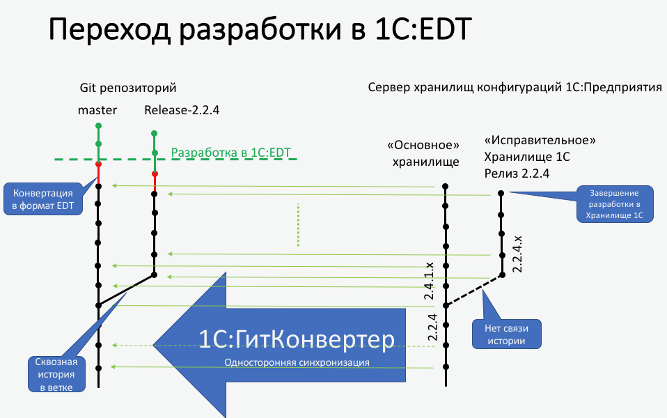

# 1С:ГитКонвертер

Конфигурация предназначена для односторонней синхронизации хранилища конфигурации "1С:Предприятия" с репозиторием Git и последующим переходом на разработку в [1C:Enterprise Development Tools (1C:EDT)](http://v8.1c.ru/overview/release_EDT_17/) с сохранением истории.

Корректное переименование истории объектов метаданных при переименовании их в хранилище конфигураций "1С:Предприятия" по UUID'дам.
Git отслеживает контент файлов, а не пути файлов. В случае с выгрузкой 1С конфигурации - в ней присутствует множество файлов, очень похожих по контенту и именам (например `ФормаСписка.xml`), отличающихся только внутренним идентификатором (UUID). Поэтому если в одной версии хранилища были удалены одни объекты (файлы), добавлены и/или переименованы другие - в Git нужно явно сообщить, что удалять, несмотря на похожие файлы в других каталогах, а так же то, какие файлы переименовываются.
Таким образом, одна версия хранилища 1С может превращаться в 3 коммита: удаление файлов, переименование, и все остальные изменения контента в файлах и добавления файлов.

### Основные возможности

* Конвертирование существующего хранилища конфигурации 1С в репозиторий Git в формате 1C:EDT
* Обновлять изменения из хранилища 1С в репозиторий Git
* Параллелизировать загрузку истории хранилища из копий хранилища
* Ограничение нагрузки на сервер с помощью очередей
* Возможно "сращивать" историю в Git, если хранилище конфигураций "1С:Предприятия" обрезалось или начиналось заново.
* Сообщение гиту команды ```git mv старый_файл новый_файл``` при переименовании метаданных
* Выгружать только изменения конфигурации. Доступно для Платформы 8.3.10 и выше, требуется использовать "очереди"
* Создание сквозной история изменений для "хранилищ исправительных версий" если вы используете [Технологию разветвленной разработки конфигураций](https://its.1c.ru/db/v8std/content/2149184358/hdoc) или аналогичный процесс - хранилище версии можно загружать в "ветку" Git, получив сквозную историю в ветке.
* УСТАРЕЛО. ~~Конвертация хранилища конфигураций 1С в формате выгрузки 1С:Предприятия~~ для совместимости с версией `1.0.4` с возможностью конвертации репозитория в формат 1C:EDT.

### Необходимые компоненты

* Конфигурацию можно запустить, используя 1C:Enterprise Development Tools 1.8.1 (https://releases.1c.ru/project/DevelopmentTools10)
* Платформа 1С:Предприятия 8.3.12 и выше (https://releases.1c.ru/project/Platform83)
* СУБД, поддерживаемая 1С:Предприятием
* OS Windows 7 или выше, ОС Linux и macOS - в бета-режиме.

## Начальная настройка

Установите на сервере 1C:EDT версии 1.8.1 и выше. Убедитесь, что корректно установлены компоненты консольного режима 1C:EDT. Для этого в терминале (командной строке) выполните команду:

 ```
 ring edt platform-versions
 ```

 убедитесь что текущая версия хранилища поддерживается в 1C:EDT.

### Настройка базы ГитКонвертера

1. Разместите базу ГитКонвертера на сервере 1С. Работа в файловом режиме может быть использована только в демонстрационных целях.
2. Заполните константу __"Путь к версиям платформы на сервере"__, где располагаются файлы Конфигуратора 1cv8(.exe) в формате: `C:\Program files (x86)\1cv8\%ВерсияПлатформы%\bin`
где в параметр `%ВерсияПлатформы%` - будет подставлена текущая версия хранилища из настроек.
4. Для ограничения производительности можно включить константу __"Использовать очереди выполнения"__ - количеством очередей можно балансировать нагрузку на сервер.

### Настройка сервера 1С

Для ИБ ГитКонвертера на сервере 1С рекомендуется настроить удаление, перенос в архив или полностью отключить журнал регистрации, т.к. интесивность событий в ИБ может быть очень высокой, а ценность истории ЖР за прошлые периоды - низкая.

Для легкого удаления и архивирования ЖР можно переключить его формат на старый режим. Для этого необходимо в каталог журнала регистрации ИБ скопировать пустой файл с именем: __1Cv8.lgf__.
Для больших проектов рекомендуется  выполнить такую настройку (удаление/бэкапирование файлов журнала регистрации).

Так же рекомендуется переключить регистрацию событий - только ошибки. Для этого следует выбрать команду __Конфигуратор - Администрирование - Настройка журнала регистрации... = Регистрировать ошибки__ и в открывшемся диалоге установить минимально необходимую вам периодичностью.


## Настройка конвертации хранилища 1С

Рекомендуется использовать сервер хранилищ конфигураций 1С.

Для оптимальной работы сервера хранилищ настройте __Размер глобального кэша__ в "Администрировании" в 1,5-2 раза больше __количества__ параллельных потоков (если используются "копии хранилища") __получения версий * размер одной версии, Мб__.

### Параметры конвертации

* Укажите адрес хранилища. При использовании сервера хранилища рекомендуется настроить в администрировании хранилища параметр "Глобальный кэш версий конфигурации" чтобы количество кэшированных версий было больше параллельно получаемых версий.
* Укажите версию платформы, рекомендуется использовать 8.3.12.1412 и выше.
* Укажите начальную версию в хранилище конфигураций, если текущее хранилище было обрезано и первая версия больше 1.
* Если указана версия окончания - не будет выполняться запрос новых версий.
* Укажите расписание запусков.
* Укажите __Каталог выгрузки версий__, в котором будут создаваться временные каталоги с номерами версий и выгрузкой данных.
* Желательно ограничить количество подготавливаемых (выгружаемых) версий - рекомендуется установить значение исходя из __Размер базы с версией + Размер выгрузки в xml__ и размера жесткого диска.
* Укажите __Минимальное количество метаданных__ - число файлов и каталогов выгрузки в xml - необходимо для контроля, что все файлы выгружены. Рекомендуется устанавливать 90-95% от текущей версии, чтобы учесть возможность удаления метаданных (т.е. сокращения количества файлов)
* Не рекомендуется устанавливать __Удаление конфигураций поставщиков__, если планируется загружать конфигурацию из файлов и обновлять конфигурации поставщиков. Опция позволяет оптимизировать размер хранилища Git и не хранить объемные файлы *.cf.
* Установите __Удалять временные данные версии после коммита__ - рекомендуется на реальных проектах.
* __Выгружать изменения__ - позволяет на Платформе 8.3.10 и выше выгружать только изменения. Доступно при использовании __"Очередей"__
* __Локальный каталог Git__ рекомендуется указывать на одном логическом диске с __Каталогом выгрузки версий__ - будет использовано перемещение версий возможностями ОС, иначе будет выполняться копирование.
* __Каталог выгрузки в репозитории__ - относительный путь к каталогу выгрузки внутри репозитория. Рекомендуется указывать имя проекта для будущей совместимости с рабочим пространством 1C:EDT или оставить пустым.
* Установите флаг __Выполнять коммиты__ для выполнения коммитов. Отключение может быть необходимо с целью временно приостановить работу конвертера.
* Установите флаг __Обрабатывать все очереди__, если используются очереди в ИБ.

Нажмите кнопку "Создать гит репозиторий" перед конвертацией - команда выполняет инициализацию репозитория и начальную настройку, специфичную для конфигураций 1С.

### Дополнительная настройка репозитория Git

По умолчанию создается файл настроек `.gitattributes` в который добавлены настройки бинарных файлов:

```
*.bin binary
*.axdt binary
*.addin binary
```

По умолчанию создается файл исключений `.gitignore`, в который добавляются файлы `DumpFilesIndex.txt` и `ConfigDumpInfo.xml` - не требуемые для работы с исходными файлами конфигурации 1С.

Если репозиторий был создан с помощью кнопки в карточке хранилища, в локальный конфиг репозитория добавляются настройки для более комфортной работы:

```bash
git config --local core.quotepath false
git config --local gui.encoding utf-8
git config --local i18n.commitEncoding utf-8
git config --local diff.renameLimit 1
git config --local diff.renames false
```

####  Символы окончания строк.
Если разработчики, работающие с репозиторием, используют разные операционные системы (Microsoft Windows, Linux, macOS), нужно настроить конвертацию символов окончания строк при чтении из репозитория. Следующие команды настраивают Git таким образом, что в рабочей копии разработчика будут использоваться "родные" для его операционной системы символы, а в репозитории всегда будет использоваться LF.

Для операционной системы Microsoft Windows:

```bash
git config --global core.autocrlf true
git config --global core.safecrlf true
```

Для операционных систем Linux и macOS:

```bash
git config --global core.autocrlf input
git config --global core.safecrlf true
```

Подробнее о назначении этих параметров вы можете прочитать в документации Git на английском языке [git config core.safecrlf](http://git-scm.com/docs/git-config#git-config-coresafecrlf) и [git config core.autocrlf](http://git-scm.com/docs/git-config#git-config-coreautocrlf).

**1С:ГитКонвертер** по умолчанию добавляет настройки окончания строк при инициализации репозитория кнопкой из формы настройки хранилища в локальные настройки репозитория:

```bash
git config --local core.autocrlf true
git config --local core.safecrlf warn
```

Т.о. в репозиторий файлы попадут с окончаниями строк попадут как `LF`, выдавая предупреждения в лог, если в файле есть смешение `CRLF` и `LF`.


#### Git LFS

Для увеличения быстродействия репозитория Git можно использовать расширение __git lfs__ (https://git-lfs.github.com)

Если используется сервер репозиториев Git, необходимо убедиться, что он поддерживает это расширение и включить настройки для проекта. Например, GitLab, GitHub, BitBucket - поддерживают.

Выполнить начальную настройку репозитория до выполнения первого коммита:

```bash
git lfs install
```

Включить отслеживание бинарных файлов конфигурации
```bash
git lfs track "*.cf"
git lfs track "*.bin"
git lfs track "*.png"
git lfs track "*.gif"
git lfs track "*.bmp"
git lfs track "*.jpg"
git lfs track "*.zip"
```
В этом примере - все файлы конфигураций поставщиков, файлы макетов с "Двоичными данными" и картинки из конфигурации попадут в lfs.

Например, чтобы переносить в LFS только некоторые типы файлов с расширением `*.bin` можно включить отслеживание только шаблонов и модулей без исходного кода по маске:

```bash
git lfs track "*/Ext/Template.bin"
git lfs track "*/Ext/Module.bin"
```

### Копии хранилища

Копии хранилища используются для ускорения получения версий из хранилища.

* Возможно использовать тот же адрес серверного хранилища конфигураций, но с разными пользователями.  Количество "копий" влияет на размер создаваемого глобального кэша версий на сервере хранилища 1С. Желательно установить кэш в настройках сервера хранилищ 1С в __полтора раза__ больше, чем количество копий в ГитКонвертере.

* Укажите другой адрес архивной копии хранилища, если в текущем хранилище конфигураций выполнялось сокращение версий, и установите ограничение номеров версий в этой копии.
* Укажите расписание получения версий из этой копии. Если в "копии" указан адрес основного хранилища, необходимо в расписании учесть возможность работы разработчиков с хранилищем - запуски на получение выполнять с промежутками, обеспечивающими комфортную работу разработчиков.

### Очереди выполнения

Если включена константа "Использовать очереди выполнения", то для каждого хранилища конфигураций необходимо указать 2 очереди:

* Выгрузка метаданных. Начиная с версии Платформы 8.3.10 возможно использовать __выгрузку изменений__ - для этого необходимо выгружать версии строго последовательно и не рекомендуется создавать более одной очереди на выгрузку.
* Загрузка метаданных

Возможно указать диапазоны количества версий для каждой очереди для разграничения "рабочей зоны". 

Укажите ограничение количества версий обрабатываемых очередью за один запуск и расписание запусков.

Очередь может быть общей на всю базу или привязанной к конкретному хранилищу. Для очереди общего типа выбор версий для обработки выполняется по дате версии - это следует учитывать при конвертации проектов с длинной историей и более "молодых" проектов в одной базе ГитКонвертера.

### Информация пользователей

Хранилище конфигураций "1С:Предприятия" использует для идентификации __Пользователя__, а в репозитории Git основным идентификатором является __email__ и имя пользователя. Для этих целей предназначен регистр сведений __Информация пользователей__, позволяющий указать соответствие пользователей хранилищ пользователям репозитория Git.

Можно выполнять коммиты анонимно, с потерей информации об авторстве. Пользователь хранилища будет указан в дополнении к комментарию к каждой версии.

Пользователи могут быть указаны общие для всех хранилищ или с уточнением по хранилищам.

## Обновление с версии 1.0.4

**Внимание!**  Конвертация хранилища 1С в формат выгрузки xml 1С:Предприятия является устаревшей функциональностью и не доступна для новых настроек конвертации хранилища. 
Текущие настройки синхронизации хранилища, конвертирующие в формат выгрузки xml 1С:Предприятия будут работать корректно, но рекомендуется выполнить разовую конвертацию в формат 1C:EDT и продолжить синхронизацию в этом формате.

## Конвертация выгрузки 1С:Предприятия в формат 1C:Enterprise Development Tools

Выполнить конвертацию необходимо разово, чтобы "переключить" текущий формат с 1С:Предприятия на формат 1C:EDT.



__Внимание!__ 
Конвертация в формат 1C:EDT необратима, поэтому последующая синхронизация с хранилищем 1С будет выполняться в формате 1C:EDT. Конечно, можно сделать "checkout" на коммит до конвертации и продолжить конвертацию в формате 1С:Предприятия в другой ветке, или откатить все изменения с помощью `git reset --hard <sha_commit>` и т.д. 
Можно так же, в тестовых целях, создать копию элемента справочника "Хранилищ" и копию репозитория - создать ветку и конвертировать в формат 1C:EDT, оставляя возможность синхронизировать хранилище конфигураций с основной веткой Git в формате 1С:Предприятия.

Структура каталогов выгрузки 1С:Предприятия и формата 1C:EDT похожи, но немного различаются. Для сохранения истории разработки в формате 1C:EDT запустите обработку __"Конвертация в формат EDT"__. Она выполняет перемещение файлов в соответствии с форматом 1C:EDT, выполняет коммит в гит, заменяет каталог `src` выгрузки 1С:Предприятия каталогом из 1C:EDT и выполняет второй коммит с изменением контента файлов.
Стоит отметить, что содержание xml-файлов 1C:EDT и 1С:Предприятия в некоторых случаях различается существенно, поэтому построчное авторство в таких файлах сохранить не удастся. 
Файлы текстов модулей `*.bsl` сохраняют историю полностью.

1. Установите 1C:EDT 1.8 и выше на сервер.
2. Если изначально каталог с именем проекта не был указан (ну забыли, не знали...) нужно заполнить **Имя проекта 1C:EDT** и будет выполнено перемещение `git mv ./src/... ./ИмяПроектаEDT/src/...` во время конвертации. Перемещение можно отключить, сняв галку **Выполнить перенос в каталог проекта**, если вы понимаете зачем это делаете.
3. Если использовали __Git LFS__ - убедитесь что типы файлов, вынесенные в __LFS__, после конвертации с новыми именами/расширениями так же попадут в __LFS__.
4. Выполните конвертацию репозитория с помощью обработки __Сервис -> Конвертация в формат EDT__, заполнив все обязательные поля.

Если изначально был указан __"Каталог выгрузки в репозитории"__ соответствующий имени проекта, после конвертации можно открыть 1C:EDT в новом  Workspace и выполнить импорт проекта из Git: __File -> Import -> Git -> Projects from Git__ и убедиться в корректности конвертации.

__Внимание!__ Рекомендуется читать документацию к 1C:EDT о настройках Git, работе с проектом, импорте и др.

Соответствие имен файлов формата выгрузки 1С:Предприятия и формата 1C:EDT

```
Configuration.xml -> Configuration.mdo
ClientApplicationInterface.xml -> ClientApplicationInterface.cai
CommandInterface.xml -> CommandInterface.cmi
HomePageWorkArea.xml -> HomePageWorkArea.hpwa
MainSectionCommandInterface.xml -> MainSectionCommandInterface.cmi
Form.xml -> Form.form
Template.xml -> Template.bin     // BinaryData
Template.xml -> Template.mxlx    // SpreadsheetDocument
Template.xml -> Template.dcs     // DataCompositionSchema
Template.xml -> Template.txt     // FileAwareTextDocument
Template.xml -> Template.htmldoc // HtmlDocument
Template.xml -> Template.addin   // AddIn
Template.xml -> Template.scheme  // GraphicalScheme
Template.xml -> Template.axdt    // ActiveDocument
Template.xml -> Template.geos    // GeographicalSchema
Template.xml -> Template.dcsat   // DataCompositionAppearanceTemplate
Package.bin -> Package.xdto
WSDefinition.xml -> WsDefinitions.wsdl
Flowchart.xml -> Flowchart.scheme
Rights.xml -> Rights.rights
Schedule.xml -> Schedule.schedule
```

Другие файлы изменят имена не значительно, в соответствии с форматом 1C:EDT. Часть файлов (`Help.xml`, `Language.xml`, `Picture.xml`, `ФормаСписка.xml` и др.) будут удалены, т.к. контент файлов теперь хранится в составе других файлов.

## Если что-то пошло не так (FAQ)

#### Расписание конвертации включено, но список версий пуст

* Проверьте, что задана константа __"Путь к версиям платформы на сервере"__ и в настройках хранилища указана версия, соответствующая версии сервера хранилища конфигураций 1С:Предприятия.
* Проверьте файл логов `log.txt` в каталоге выгрузок - там может быть написано что-то вразумительное.
* Проверьте журнал регистрации базы 1С:ГитКонвертера - на наличие ошибок. Все мы - люди :)

#### Версии в списке ИБ 1С:ГитКонвертера есть, но конкретная версия зависла (зациклилась) на этапе выгрузки конфигурации в xml

* Можно посмотреть в лог пакетной операции для этой версии `/каталог выгрузки версий/ХХХ/log.txt` - пакетная операция Конфигуратора может сообщить что-то полезное
* Если база версии "развалилась" в контекстном меню формы списка версий __сбросить состояние__  версии - она будет получена заново из хранилища.

#### Версии обрабатываются, но не коммитятся в Git

* Проверьте, разрешен ли анонимный коммит в Git
* Проверьте список версий хранилища - красным подсвечиваются версии, для авторов которых не указана контактная информация в регистре "Информация пользователей"
* Нажмите кнопку "Выполнить коммиты" - для принудительного запуска коммитов обработанных версий в статусе "Метаданные загружены"

#### Коммиты не появляются на сервере Git

* Адрес Git-сервера был добавлен после создания хранилища? Нужно нажать кнопку "Установить адрес репозитория Git" чтобы настройки появились в config-файле.
* Откройте гит-клиент - проверьте, есть ли коммиты в локальном репозитории
* Посмотрите лог коммита на Git-сервер, расположенные `/каталог выгрузки версий/gi_log_ver_XXX.txt`
* Выполните команду `git push -u origin <branch name>` в консоли, чтобы проверить push вручную
* Проверьте права доступа для пользователя от которого запущен сервер 1С - от его имени выполняется запуск скриптов `*.bat/*.sh` и глобальные настройки Git для этого пользователя.

#### В какой-то версии произошел сбой и файлы версии закомичены не полностью

Т.е. в этой версии часть файлов или все были сначала удалены в репозитории, а следующая версия добавила файлы заново - сквозная история потерялась :(

* Можно установить контроль минимального количества файлов в выгрузке, чтобы такого не случалось в будущем.
* Т.к. это "односторонняя синхронизация" - то можно беспрепятственно откатить изменения `git reset --hard <commit>` на версию, до проблемной. 
	* Далее в карточке хранилища установить поле "Версия в Git" на текущую в Git.
	* Для всех версий, начиная с "проблемной" и последующих, выполнить команду в контекстном меню "Сбросить состояние"
	* В каталоге `src` удалить файлы `DumpFilesIndex.txt` и `ConfigDumpInfo.xml` т.к. они не хранятся в репозитории и не откатились.
	* Проверить что командные файлы `*.bat` (или `*.sh`) удалены для всех версий, начиная с проблемной.
	* Если была установлена настройка Git-сервера, необходимо на сервере отключить защиту ветки (если есть такое) и выполнить `git push -u -f origin <branch name>` принудительную передачу данных с заменой репозитория на сервере.

#### В хранилище версия есть, а в Git она пропущена

* Хранилище Конфигураций 1С:Предприятия позволяет сохранять новую версию без фактического изменения контента файлов, если меняется внутренняя версия объекта метаданных. Для Git в этом случае нечего коммитить.
* Откройте файлы логов и убедитесь в том, что версия была обработана корректно
